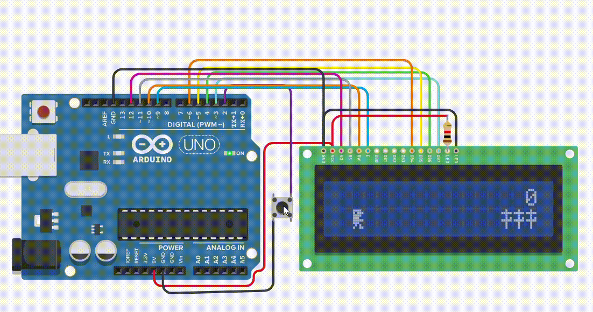
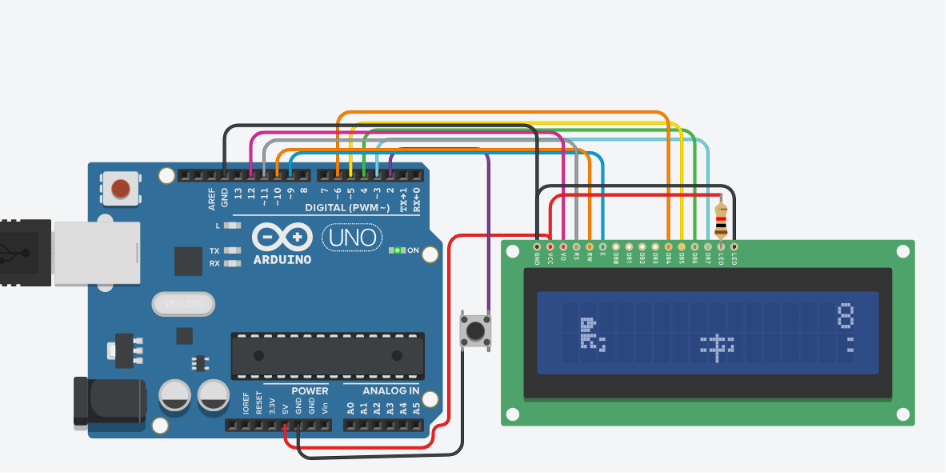

# LCD Dino Game

> A recreation of Google's Chrome Dino game on a **16×2 HD44780 LCD** using an **Arduino Uno**.

<p align="center">
  
</p>

<p align="center">
  <em>Jump over randomly generated cacti and survive for as long as possible.</em>
</p>

---

## Overview

The **LCD Dino Game** recreates the iconic Google Chrome Dino game on a standard **16×2 character LCD** using an Arduino Uno.

Despite the limitations of a character LCD, the project implements smooth gameplay featuring custom LCD graphics, interrupt-driven controls, obstacle generation, collision detection, and real-time score tracking. It demonstrates how simple embedded hardware can be used to build an interactive real-time application.

---

## Hardware Implementation

<p align="center">
  
</p>

The project was designed and simulated in **Tinkercad** using an Arduino Uno, a standard 16×2 HD44780 LCD operating in 4-bit mode, and a push button connected to an external interrupt pin.

The Arduino continuously updates the LCD with custom-generated sprites, manages game logic, processes player input, and renders the current score in real time.

---

## Features

- 🦖 Animated Dino using custom LCD characters
- 🎮 Endless runner gameplay inspired by Google's Chrome Dino
- ⚡ Interrupt-driven jump control
- 🌵 Randomly generated cactus obstacles
- 💥 Collision detection
- 📈 Live score tracking
- 🔁 Automatic restart after game over
- 📺 Optimized for a standard 16×2 HD44780 LCD

---

## How It Works

When powered on, the Arduino initializes custom LCD characters representing the Dino and cactus sprites using the LCD's Character Generator RAM (CGRAM).

The player starts the game using a push button connected to an external interrupt. During gameplay, the Arduino continuously:

- Animates the Dino
- Generates random cactus obstacles
- Detects collisions
- Updates the player's score
- Refreshes the LCD display

If the Dino collides with an obstacle, the game immediately ends and returns to the start screen, allowing another run with a single button press.

---

## Hardware Used

| Component | Quantity |
|-----------|---------:|
| Arduino Uno | 1 |
| 16×2 HD44780 LCD | 1 |
| Push Button | 1 |
| 220 Ω Resistor | 1 |
| Jumper Wires | As required |

---

## Repository Structure

```text
lcd-dino-game/
├── images/
│   ├── gameplay.gif
│   └── tinkercad_circuit_implementation.png
│
├── lcd_dino_game.ino
├── README.md
├── LICENSE
└── .gitignore
```

---

## Future Improvements

Possible future enhancements include:

- Progressive game difficulty
- Increasing obstacle speed
- Multiple obstacle types
- Sound effects using a piezo buzzer
- EEPROM-based high score storage
- Pause functionality
- OLED or TFT display support

---

## License

This project is licensed under the **MIT License**.